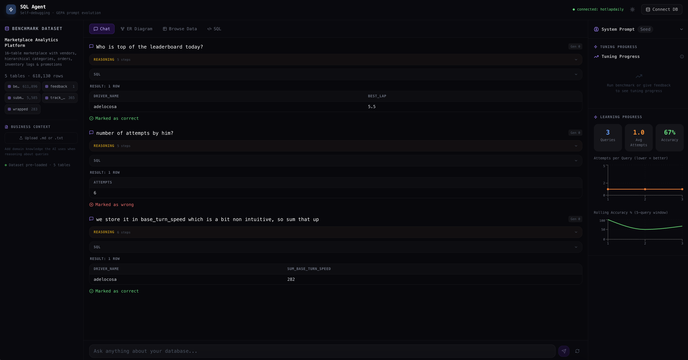

<h1 align="center">
  <br>
  
  <br>
  SQL Agent
  <br>
</h1>

<p align="center">
  <strong>Self-Debugging &nbsp;&middot;&nbsp; GEPA Prompt Evolution &nbsp;&middot;&nbsp; RL Environment</strong>
</p>

<p align="center">
  An AI SQL agent that gets measurably better over time — without retraining the model.
</p>

<p align="center">
  <a href="#quick-start"><strong>Quick Start</strong></a> &nbsp;&middot;&nbsp;
  <a href="#how-it-works"><strong>How It Works</strong></a> &nbsp;&middot;&nbsp;
  <a href="#architecture"><strong>Architecture</strong></a> &nbsp;&middot;&nbsp;
  <a href="#rl-environment"><strong>RL Environment</strong></a> &nbsp;&middot;&nbsp;
  <a href="#research"><strong>Research</strong></a>
</p>

<p align="center">
  
  
  
  
  
</p>

<p align="center">
  
</p>

---

An AI SQL agent that **gets measurably better over time** — without retraining or fine-tuning the model. It combines three research ideas running together in one app:

1. **Self-Debug Loop** — the agent critiques and fixes its own SQL errors, no human in the loop
2. **GEPA Prompt Evolution** — after user feedback, an LLM reflects on failures and evolves the system prompt
3. **Mini-RL Environment** — a LinUCB contextual bandit learns which repair strategy works best for each error type

The result: pure prompt + context engineering. No model weights needed.

---

## Quick Start

```bash
git clone https://github.com/Ar9av/gepa-tuned-sql-agent
cd gepa-tuned-sql-agent
npm install
```

Create `.env.local`:

```env
AZURE_API_KEY=your_key_here
AZURE_BASE_URL=https://your-endpoint.services.ai.azure.com/models
AZURE_MODEL=gpt-4o-mini
```

```bash
npm run dev
# open http://localhost:3000
```

The benchmark dataset seeds automatically on first load. No schema generation step, no data population step — the demo is ready immediately.

> Uses **SQLite in-process** via `better-sqlite3` for the benchmark DB. Connect your own **PostgreSQL** or **MySQL** via the Connect DB button.

---

## How It Works

### The Feedback Loop

```
User asks a question
      |
      v
  [LLM generates SQL] ──> Execute ──> Success? ──> Show results
      ^                                  |                |
      |                                 No               User marks
      |                                  |            correct/wrong
      |                                  v                |
  [RL bandit picks            Self-debug loop         Suggestion?
   repair strategy]           (up to 5 retries)          |
      |                           |                      v
      |                           v               GEPA optimizer
      |                    Error classified        evolves prompt
      |                    (8 canonical types)          |
      |                           |                     v
      +------ learns from -------+            Prompt diff shown
              experience                      inline in chat
```

### Three Layers of Improvement

| Layer | What improves | How | Persists across sessions |
|---|---|---|---|
| **Self-Debug** | Individual query | Retries with error context, up to 5 attempts | No |
| **GEPA** | System prompt | LLM reflects on failures + user feedback, evolves rules | Yes (per connection) |
| **RL Bandit** | Repair strategy selection | LinUCB learns error-type -> best-fix mapping | Yes (weights file) |

---

## Features

### Chat Interface
- **Conversational SQL** — ask questions in natural language, get results
- **Conversation context** — follow-up questions reference prior Q&A pairs
- **Inline optimization cards** — see exactly when and how the prompt evolved
- **Re-run after optimization** — one-click retry with the improved prompt
- **Gen badge** — every message shows which prompt generation was used
- **Suggestion detection** — type corrections like "use best_lap column" and they feed directly into GEPA

### Prompt Evolution (GEPA)
- **Automatic trigger** — fires after consecutive wrong feedback
- **User feedback as ground truth** — your corrections drive the optimization
- **Dialect-aware** — generates PostgreSQL/MySQL/SQLite rules based on your connection
- **GitHub-style diff viewer** — full modal with line-by-line diffs, generation timeline, reflection
- **Inline diff preview** — mini diffs right in the chat stream

### RL Environment
- **8 error classes** — `no_such_column`, `syntax_error`, `aggregation_error`, etc.
- **8 repair strategies** — `fix_column`, `rewrite_cte`, `change_dialect`, etc.
- **LinUCB bandit** — learns which strategy works for which error type
- **Shaped rewards** — attempt penalty, error-severity improvement bonus
- **Hindsight Experience Replay** — multiplies sparse reward signal
- **API endpoint** — `GET /api/rl-state` for metrics, action distribution, episode history

### Multi-Database
- **SQLite** (in-process, no setup)
- **PostgreSQL** (connection string)
- **MySQL** (connection string)
- Schema auto-extracted, ER diagram auto-generated

### UX
- **Light/Dark mode** — toggle in header, persisted
- **Mobile responsive** — sidebars collapse to overlays, tab bar scrolls
- **Session persistence** — chat history saved to `.sessions/` per database
- **Business context upload** — `.md`/`.txt` files injected into LLM reasoning
- **Live performance graphs** — accuracy and attempts-per-query charts

---

## Architecture

```
+--------------------------------------------------------------+
|                    Next.js (App Router)                        |
|                                                               |
|  Left sidebar       Centre (tabs)           Right sidebar     |
|  ────────────       ─────────────           ─────────────     |
|  Dataset info  ->   Chat                ->  System Prompt     |
|  Table stats        ER Diagram              Prompt Evolution  |
|  Biz context        Browse Data             Tuning Graph      |
|                     SQL Playground          Performance Graph  |
|                     Benchmark                                 |
+──────────────────────────┬────────────────────────────────────+
                           | SSE streaming
+──────────────────────────v────────────────────────────────────+
|                    API Routes (Node.js)                        |
|                                                               |
|  /api/chat          conversational SQL + reasoning             |
|  /api/feedback      user feedback -> GEPA trigger              |
|  /api/rl-state      bandit metrics + episode history           |
|  /api/sessions      session persistence (save/load)            |
|  /api/benchmark     golden query evaluation                    |
|  /api/connect       multi-DB connection management             |
|  /api/schema-graph  ER extraction via PRAGMA/information_schema|
+──────────────────────────┬────────────────────────────────────+
                           |
        +------------------+------------------+
        |                  |                  |
   SQLite (local)    PostgreSQL          MySQL
   better-sqlite3       Knex              Knex
```

### Key Files

```
lib/
  rl/
    types.ts              # ErrorClass, RepairAction, RLState, featurize()
    error-classifier.ts   # SQLite error -> 8 canonical types
    repair-strategies.ts  # 8 prompt templates per repair action
    grader.ts             # Shaped reward function
    linucb.ts             # LinUCB contextual bandit (Sherman-Morrison updates)
    experience.ts         # Episode logging + Hindsight Experience Replay
    environment.ts        # Gym-like interface: reset/step/observe/endEpisode
  gepa.ts                 # GEPA optimizer: reflect -> mutate -> score
  sql-agent.ts            # Self-debug loop with RL integration
  input-classifier.ts     # Query vs suggestion detection
  session-store.ts        # .sessions/ persistence
  diff.ts                 # LCS-based line diff engine
  llm.ts                  # Azure OpenAI client
  connector.ts            # Multi-DB connection (SQLite/PG/MySQL)
  schema-extractor.ts     # Cross-DB schema introspection
```

---

## RL Environment

The Mini-RL environment formalizes the debug loop as a contextual bandit problem.

### State Space (20 dimensions)

```
[error_class (8-dim one-hot)]     # which type of SQL error
[attempt_number (1 scalar)]       # normalized 0-1
[previous_action (8-dim one-hot)] # what repair was tried last
[error_changed (1 binary)]        # did the error type change?
[consecutive_same_error (1)]      # stuck counter
[bias (1)]                        # constant term
```

### Action Space (8 discrete actions)

| Action | When to use |
|---|---|
| `REWRITE_FULL` | Fundamentally flawed query, start over |
| `FIX_COLUMN` | Wrong column name referenced |
| `FIX_TABLE` | Wrong table name or JOIN |
| `ADD_GROUPBY` | Aggregation / GROUP BY mismatch |
| `REWRITE_CTE` | CTE / subquery structure issues |
| `FIX_SYNTAX` | Syntax errors, typos |
| `CHANGE_DIALECT` | Wrong SQL dialect (e.g., PostgreSQL syntax in SQLite) |
| `RELAX_FILTER` | Overly restrictive WHERE conditions |

### Reward Function

```
Success:  +1.0 - 0.1 * (attempt - 1)        # faster = better
Failure:  -0.1 - 0.05 * attempt              # escalating penalty
          +0.2 if error severity decreased    # progress signal
          +0.1 if error class changed         # exploration signal
Episode:  +0.5 terminal bonus (success)
          -0.5 terminal penalty (failure)
```

### Monitoring

```bash
# Check bandit state
curl http://localhost:3000/api/rl-state | jq .

# Action distribution — is it learning?
curl -s http://localhost:3000/api/rl-state | jq '.metrics.actionDistribution'

# Reset RL weights
curl -X DELETE http://localhost:3000/api/rl-state
```

---

## Session Persistence

Chat sessions are saved to `.sessions/{db_hash}/` automatically.

**What's saved:**
- Messages: question, SQL, feedback, rowCount, columns, first 3 rows preview
- Prompt evolution: generation, score, reflection, diff summary
- Stats: total queries, correct/wrong counts, avg attempts

**What's NOT saved:** Full output rows (only truncated previews).

```bash
# List all sessions
curl http://localhost:3000/api/sessions

# Load a specific session
curl http://localhost:3000/api/sessions?db=MyDatabase
```

**Other persistent data:**
| Data | Location | Survives restart |
|---|---|---|
| RL weights | `data/rl-weights.json` | Yes |
| RL episodes | `data/rl-experiences.json` | Yes |
| GEPA prompts | `data/connections.json` | Yes |
| Chat sessions | `.sessions/` | Yes |
| In-memory state | Zustand store | No (page refresh) |

---

## Research

### Self-Refine & Self-Correction

> *"LLM generation is done in a single pass — susceptible to errors. Self-refinement closes the loop: generate -> critique -> refine."*

- **Self-Refine** (Madaan et al., 2023) — LLMs iteratively improve outputs using self-generated feedback
- **Self-Debugging** (Chen et al., 2023) — adds hard external signals (execution + stack traces) to the critique step
- **Key insight in this demo:** SQL execution errors from the database are hard ground-truth signals
- [CMU LLM Inference (8): Self-Refine and Self-Correction Methods](https://www.youtube.com/watch?v=uaxf9yssDy4)

### GEPA — Reflective Prompt Evolution

> *"Rather than collapsing execution traces into a scalar reward, GEPA uses LLM reflection as a text-domain gradient — outperforming RL while using 35x fewer evaluations."*

- **Paper:** [GEPA: Reflective Prompt Evolution Can Outperform RL](https://arxiv.org/abs/2507.19457)
- **GitHub:** [gepa-ai/gepa](https://github.com/gepa-ai/gepa)
- **DSPy integration:** [dspy.ai/api/optimizers/GEPA](https://dspy.ai/api/optimizers/GEPA/overview/)

| Task | Before GEPA | After GEPA |
|---|---|---|
| AIME math (GPT-4.1 Mini) | 46.6% | 56.6% (+10pp) |
| ARC-AGI agent | 32 | 89 |
| MATH benchmark (DSPy) | 67% | 93% |
| vs RL (GRPO) | — | +6pp avg |
| vs RL on rollout count | 5,000-25,000 | 100-500 (35x fewer) |

### RL in Prompt Space

> *"GEPA is RL — but at the prompt space instead of the weight space."*

The Mini-RL environment in this demo formalizes the debug loop as a contextual bandit (LinUCB). The conceptual lineage:

**Q-Learning -> Actor-Critic -> PPO/GRPO -> GEPA -> This demo**

Each step solved the previous method's bottleneck: dimensionality -> instability -> sample efficiency -> API-only access -> learning repair strategies from real user traffic.

- [From Q-Learning to LLMs: Mastering Post-Training](https://medium.com/learnwithnk/from-q-learning-to-llms-mastering-the-bedrock-of-post-training-8e80491f3a01)

---

## Stack

| | |
|---|---|
| Framework | Next.js 15, TypeScript, App Router |
| Styling | Tailwind CSS v4 |
| Animations | Framer Motion |
| Charts | Recharts |
| Database | SQLite (better-sqlite3), PostgreSQL, MySQL (via Knex) |
| LLM | Azure AI Foundry (OpenAI-compatible SDK) |
| State | Zustand |
| Icons | Lucide React |
| Markdown | react-markdown |
| RL | Custom LinUCB implementation (no Python deps) |

---

## License

MIT
